# DepotButler Architecture Diagrams

## System Overview

## Clean Architecture Layers

## Workflow Execution Flow

## Data Model Relationships

## Authentication & Security Flow

## Publication Processing State Machine

## OneDrive Upload Strategy

```mermaid
graph TD
    START[Start Upload] --> SIZE{File size?}

    SIZE -->|< 4MB| SIMPLE[Simple Upload<br/>Single PUT request]
    SIZE -->|≥ 4MB| CHUNKED[Chunked Upload<br/>10MB chunks]

    SIMPLE --> CREATE_SESSION[Create upload session]
    CREATE_SESSION --> UPLOAD[Upload file]
    UPLOAD --> SUCCESS

    CHUNKED --> CREATE_CHUNKED[Create upload session]
    CREATE_CHUNKED --> LOOP[For each 10MB chunk]
    LOOP --> SEND[Send chunk with range]
    SEND --> CHECK{All chunks sent?}
    CHECK -->|No| LOOP
    CHECK -->|Yes| SUCCESS[✓ Upload complete]

    UPLOAD --> ERROR{Error?}
    SEND --> ERROR
    ERROR -->|Timeout| RETRY{Retry < 3?}
    ERROR -->|Auth| FAIL[✗ Upload failed]
    ERROR -->|Other| FAIL

    RETRY -->|Yes| SEND
    RETRY -->|No| FAIL

    SUCCESS --> ORGANIZE{Organize by year?}
    ORGANIZE -->|Yes| YEAR_FOLDER["📁 /publications/2025/file.pdf"]
    ORGANIZE -->|No| BASE_FOLDER["📁 /publications/file.pdf"]

    YEAR_FOLDER --> END[Done]
    BASE_FOLDER --> END
    FAIL --> END
```

## Admin Script Ecosystem

## Error Handling & Monitoring

## Deployment Architecture

---

## Diagram Legend

- **Green**: Active processes/services
- **Blue**: External services/APIs
- **Teal**: Database/storage
- **Orange**: Authentication/security
- **Red**: Errors/failures

## Related Documentation

- [architecture.md](architecture.md) - Detailed architecture description
- [DEPLOYMENT.md](DEPLOYMENT.md) - Deployment procedures
- [MONGODB.md](MONGODB.md) - Database schema details
- [CONFIGURATION.md](CONFIGURATION.md) - Configuration guide
